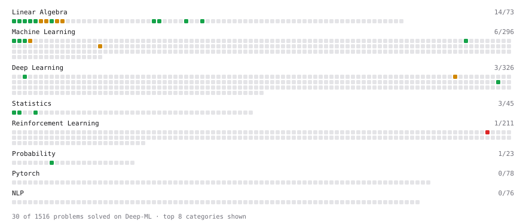

# Deep-ML

My machine learning practice from [Deep-ML](https://www.deep-ml.com). Every solution here was written by hand.

**37** solved · 27 problems · 2 labs · 8 math

[**Browse the interactive portfolio**](https://KvotheArcaneFarseer.github.io/deep-ml/) to replay this filling in over time.

## Problems

| | Difficulty | Solved | |
| --- | --- | --- | --- |
| [Calculate 2x2 Matrix Inverse](https://www.deep-ml.com/problems/8) | easy | 2026-06-30 | [solution](problems/0008-calculate-2x2-matrix-inverse) |
| [Calculate Cosine Similarity Between Vectors](https://www.deep-ml.com/problems/76) | easy | 2026-09-17 | [solution](problems/0076-calculate-cosine-similarity-between-vectors) |
| [Calculate Covariance Matrix](https://www.deep-ml.com/problems/10) | easy | 2026-07-07 | [solution](problems/0010-calculate-covariance-matrix) |
| [Calculate Mean by Row or Column](https://www.deep-ml.com/problems/4) | easy | 2026-05-21 | [solution](problems/0004-calculate-mean-by-row-or-column) |
| [Derivative of a Polynomial](https://www.deep-ml.com/problems/116) | easy | 2026-04-07 | [solution](problems/0116-derivative-of-a-polynomial) |
| [Dot Product Calculator](https://www.deep-ml.com/problems/83) | easy | 2026-09-15 | [solution](problems/0083-dot-product-calculator) |
| [Feature Scaling Implementation](https://www.deep-ml.com/problems/16) | easy | 2026-09-10 | [solution](problems/0016-feature-scaling-implementation) |
| [Gradient Direction and Magnitude](https://www.deep-ml.com/problems/308) | easy | 2026-10-02 | [solution](problems/0308-gradient-direction-and-magnitude) |
| [Hash-Based Expert Routing for MoE Layers](https://www.deep-ml.com/problems/731) | easy | 2026-05-20 | [solution](problems/0731-hash-based-expert-routing-for-moe-layers) |
| [Linear Regression Using Gradient Descent](https://www.deep-ml.com/problems/15) | easy | 2026-09-08 | [solution](problems/0015-linear-regression-using-gradient-descent) |
| [Linear Regression Using Normal Equation](https://www.deep-ml.com/problems/14) | easy | 2026-09-07 | [solution](problems/0014-linear-regression-using-normal-equation) |
| [Matrix-Vector Dot Product](https://www.deep-ml.com/problems/1) | easy | 2026-03-23 | [solution](problems/0001-matrix-vector-dot-product) |
| [Reshape Matrix](https://www.deep-ml.com/problems/3) | easy | 2026-06-20 | [solution](problems/0003-reshape-matrix) |
| [Scalar Multiplication of a Matrix](https://www.deep-ml.com/problems/5) | easy | 2026-06-20 | [solution](problems/0005-scalar-multiplication-of-a-matrix) |
| [Single Neuron](https://www.deep-ml.com/problems/24) | easy | 2026-09-12 | [solution](problems/0024-single-neuron) |
| [Transpose of a Matrix](https://www.deep-ml.com/problems/2) | easy | 2026-03-29 | [solution](problems/0002-transpose-of-a-matrix) |
| [Vector Element-wise Sum](https://www.deep-ml.com/problems/121) | easy | 2026-09-15 | [solution](problems/0121-vector-element-wise-sum) |
| [Vector Norms (L1/L2/L-inf) and the Frobenius Norm](https://www.deep-ml.com/problems/328) | easy | 2026-09-17 | [solution](problems/0328-vector-norms-l1-l2-l-inf-and-the-frobenius-norm) |
| [Calculate Eigenvalues of a Matrix](https://www.deep-ml.com/problems/6) | medium | 2026-06-29 | [solution](problems/0006-calculate-eigenvalues-of-a-matrix) |
| [Implement INT8 Quantization](https://www.deep-ml.com/problems/294) | medium | 2026-03-24 | [solution](problems/0294-implement-int8-quantization) |
| [Implement Isolation Forest for Anomaly Detection](https://www.deep-ml.com/problems/367) | medium | 2026-04-01 | [solution](problems/0367-implement-isolation-forest-for-anomaly-detection) |
| [K-Means Clustering](https://www.deep-ml.com/problems/17) | medium | 2026-09-16 | [solution](problems/0017-k-means-clustering) |
| [Matrix times Matrix ](https://www.deep-ml.com/problems/9) | medium | 2026-07-11 | [solution](problems/0009-matrix-times-matrix) |
| [Matrix Transformation ](https://www.deep-ml.com/problems/7) | medium | 2026-09-07 | [solution](problems/0007-matrix-transformation) |
| [Quotient Rule for Derivatives](https://www.deep-ml.com/problems/312) | medium | 2026-09-30 | [solution](problems/0312-quotient-rule-for-derivatives) |
| [Solve Linear Equations using Jacobi Method](https://www.deep-ml.com/problems/11) | medium | 2026-09-09 | [solution](problems/0011-solve-linear-equations-using-jacobi-method) |
| [Off-Policy n-Step TD Prediction with Importance Sampling](https://www.deep-ml.com/problems/549) | hard | 2026-09-14 | [solution](problems/0549-off-policy-n-step-td-prediction-with-importance-sampling) |

## Labs

| | Difficulty | Solved | |
| --- | --- | --- | --- |
| [Train a Binary Classifier](https://www.deep-ml.com/labs/23) | easy | 2026-05-21 | [solution](labs/0023-train-a-binary-classifier) |
| [Train a Linear Regression Model](https://www.deep-ml.com/labs/18) | easy | 2026-06-14 | [solution](labs/0018-train-a-linear-regression-model) |

## Math

| | Difficulty | Solved | |
| --- | --- | --- | --- |
| [Derivatives and Gradients](https://www.deep-ml.com/math-problems/1) | easy | 2026-09-17 | [solution](math/0001-derivatives-and-gradients) |
| [Descriptive Statistics](https://www.deep-ml.com/math-problems/18) | easy | 2026-10-03 | [solution](math/0018-descriptive-statistics) |
| [Gradient Descent Updates](https://www.deep-ml.com/math-problems/5) | easy | 2026-09-17 | [solution](math/0005-gradient-descent-updates) |
| [Matrix Basics](https://www.deep-ml.com/math-problems/9) | easy | 2026-09-14 | [solution](math/0009-matrix-basics) |
| [Probability Fundamentals](https://www.deep-ml.com/math-problems/19) | easy | 2026-10-03 | [solution](math/0019-probability-fundamentals) |
| [Vector Operations](https://www.deep-ml.com/math-problems/7) | easy | 2026-09-14 | [solution](math/0007-vector-operations) |
| [Matrix Multiplication](https://www.deep-ml.com/math-problems/10) | medium | 2026-09-14 | [solution](math/0010-matrix-multiplication) |
| [Vector Norms and Linear Independence](https://www.deep-ml.com/math-problems/8) | medium | 2026-09-14 | [solution](math/0008-vector-norms-and-linear-independence) |

---

_This file is regenerated by Deep-ML on every push._
